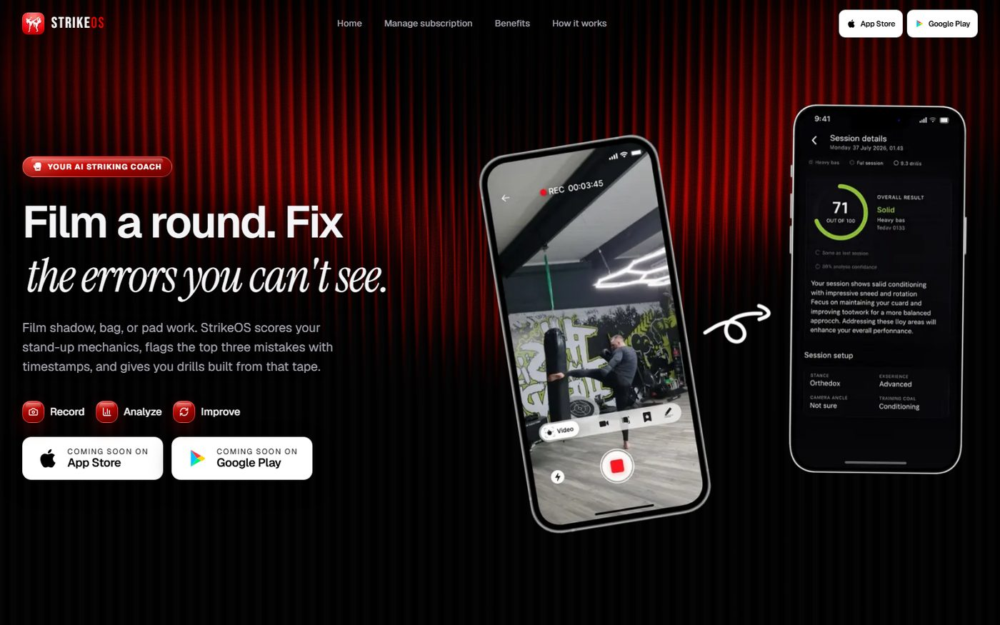
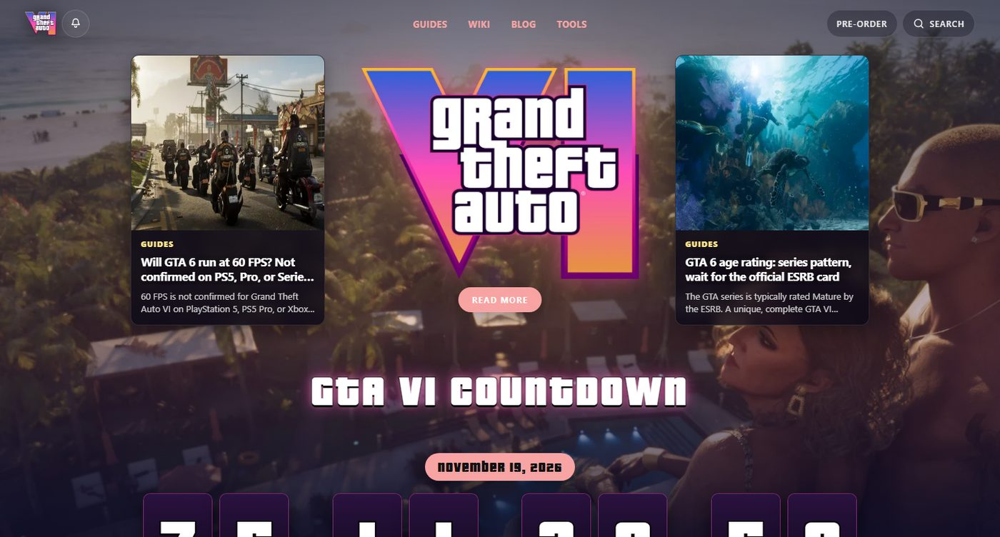
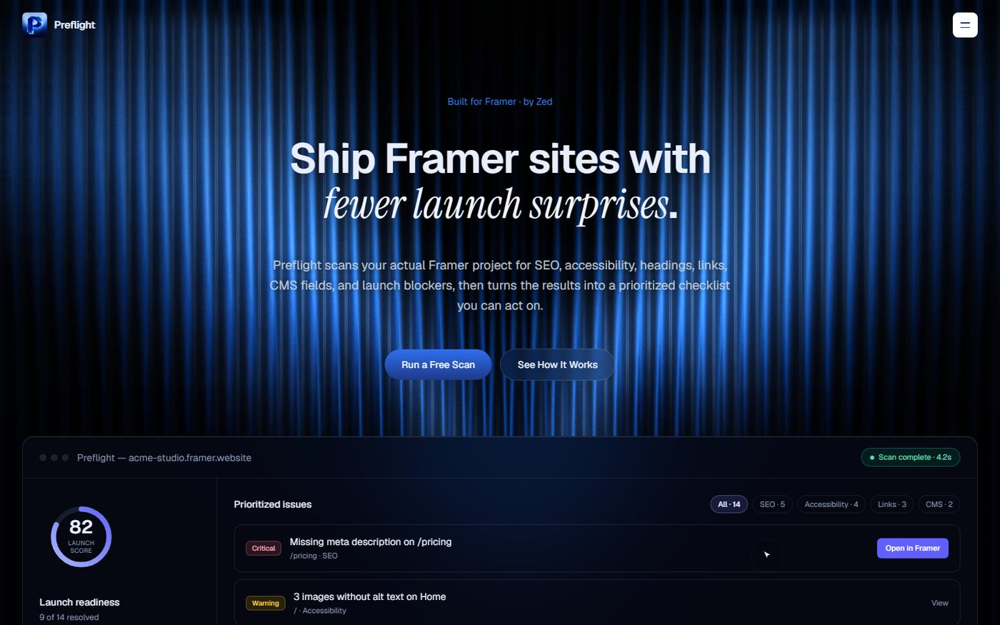
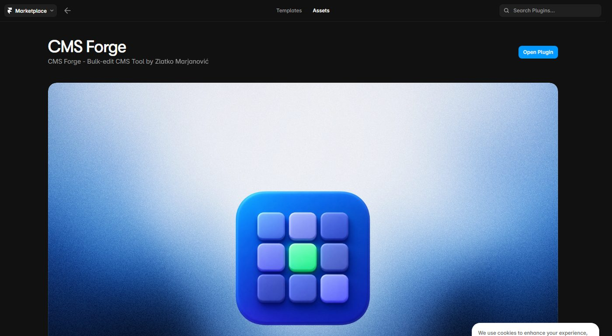
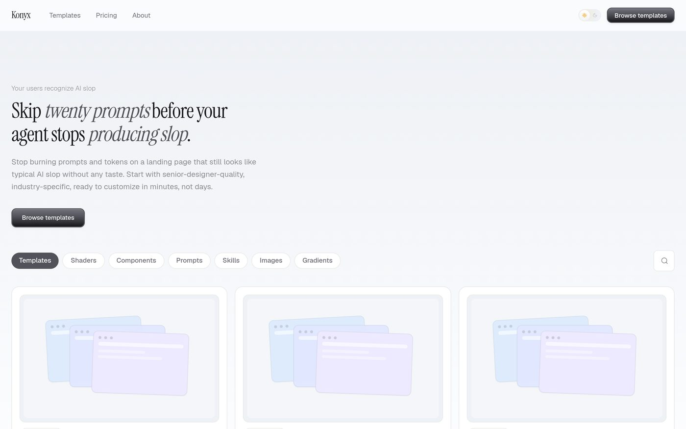
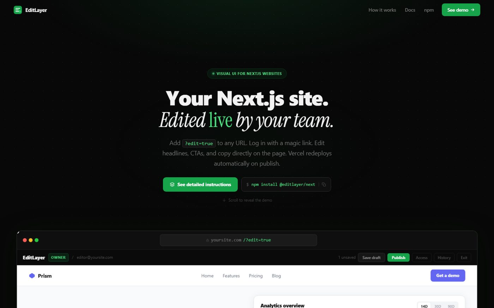

# Zlatko Marjanović

### AI Product Developer

**Cursor · Claude Code · Next.js · Supabase**

I take AI-generated prototypes and ship production products. 
Then I stay on as the person who owns the thing.

 

 

`7+ years` `120+ projects` `$100K+ earned` `50+ five-star reviews`

 

---

## Now

**[StrikeOS](https://strikeos.co)** · AI striking coach

Film a round. Get a score, the top three mistakes with timestamps, and drills built from that tape.

`Next.js` `AI vision` `product` `shipping now`

 

---

## Products

<table>
<tr>
<td width="50%" valign="top">

#### [WhenGTA6](https://www.whengta6.com) · GTA VI content site

SEO publication around the GTA VI launch. Countdown, guides, rumor board, and search pages built to rank.

`Astro` `SEO` `content system`

</td>
<td width="50%" valign="top">

#### [Preflight](https://preflight-landing-page.vercel.app) · Framer launch QA

Scans a live Framer project for SEO, a11y, CMS, and launch blockers. Optional MCP auto-fix.

`Framer plugin` `Claude` `MCP`

</td>
</tr>
<tr>
<td width="50%" valign="top">

#### [CMS Forge](https://www.framer.com/marketplace/plugins/cms-forge/) · Framer CMS editor

Spreadsheet-style bulk edit for Framer collections. Find/replace, CSV, validation, safer publish.

`Framer plugin` `CMS` `bulk edit`

</td>
<td width="50%" valign="top">

#### [Konyx](https://konyx-gold.vercel.app) · Next.js template store

Senior-quality industry templates so AI-assisted builds start designed, not generic.

`Next.js` `templates` `design systems`

</td>
</tr>
<tr>
<td width="50%" valign="top">

#### [EditLayer](https://editlayer-landing.vercel.app) · live visual editing

Add `?edit=true` to a Next.js site. Edit copy on the page. Publish. Vercel redeploys.

`Next.js` `npm` `inline editing`

</td>
<td width="50%" valign="top">

 

**[Pocketrun](https://github.com/zlatkomarjanovic/Pocketrun)** · mobile control for local agents  
PTY over WebSocket. Drive Cursor / Claude Code from your phone.

**[ByZ](https://www.framer.com/@zlatkom/)** · Framer Marketplace  
Components used by **3,000+** builders.

`agents` `Framer` `open source`

</td>
</tr>
</table>

 

---

## Client work

<table>
<tr>
<td width="50%" valign="top">

#### [Vault Apps](https://www.vaultapps.com/) · SaaS marketing platform

Conversion UX, CMS, performance, and technical SEO for a software agency that needed to present work clearly and maintain it without a full-time developer.

`SaaS` `CMS` `CRO` `SEO`

</td>
<td width="50%" valign="top">

#### [Mavesta Media](https://mavestamedia.com/) · brand + platform rebuild

Full brand refresh, UI, CMS, SEO, and conversion motion. Built so the company can sell services and keep growing the site.

`brand` `UX` `motion` `CMS`

</td>
</tr>
<tr>
<td width="50%" valign="top">

#### [MAVI Longevity](https://mavilongevity.com/) · wellness real estate

Positioning, cinematic UX, and dual funnels for developers and homeowners around the Longevity Home Blueprint.

`positioning` `lead systems` `UX`

</td>
<td width="50%" valign="top">

#### [EGC NYC](https://egcnyc.org/) · nonprofit platform

Program discovery, CMS, SEO, and local search. Ranked **#1 for "EGC NYC"** and drives **~50k monthly visitors**.

`SEO` `CMS` `nonprofit`

</td>
</tr>
</table>

 

---

## How I work

| | |
| --- | --- |
| **AI → production** | Take a Cursor / Claude Code / Lovable / Bolt / v0 prototype and make it a real product. Auth, data, payments, deploy, the unglamorous parts. |
| **Stay as owner** | I do not disappear after launch. I keep shipping, fixing, and owning the roadmap. |
| **Full stack** | Next.js, React, TypeScript, Supabase, PostgreSQL, Firebase, Stripe, OpenAI / Claude / Gemini, Vercel, n8n. |
| **Craft when it matters** | Design systems, motion, SEO, and conversion. Webflow and Framer when the job is a marketing surface, not as the identity. |

 

## Experience

- **7+ years** shipping websites, products, and growth systems
- **120+ projects** across SaaS, healthcare, wellness, real estate, and nonprofits
- **$100K+** earned across platforms · **50+** five-star reviews
- **Upwork** 100% Job Success · **$50/hr** · long-term product seats
- **Framer Marketplace** developer · Preflight + CMS Forge + 3K+ component users
- **ZedNova** founder · studio for product and web work
- Based in Bosnia (CET) · full-time, 30+ hrs/week

> *"The best web developer you could ever ask for — he did an amazing job with our website and we will be working with him in the future for more projects."*
>
> **Alexander Karima** · Co-founder, [Mavesta Media](https://mavestamedia.com/)

 

### Stack

  

  

