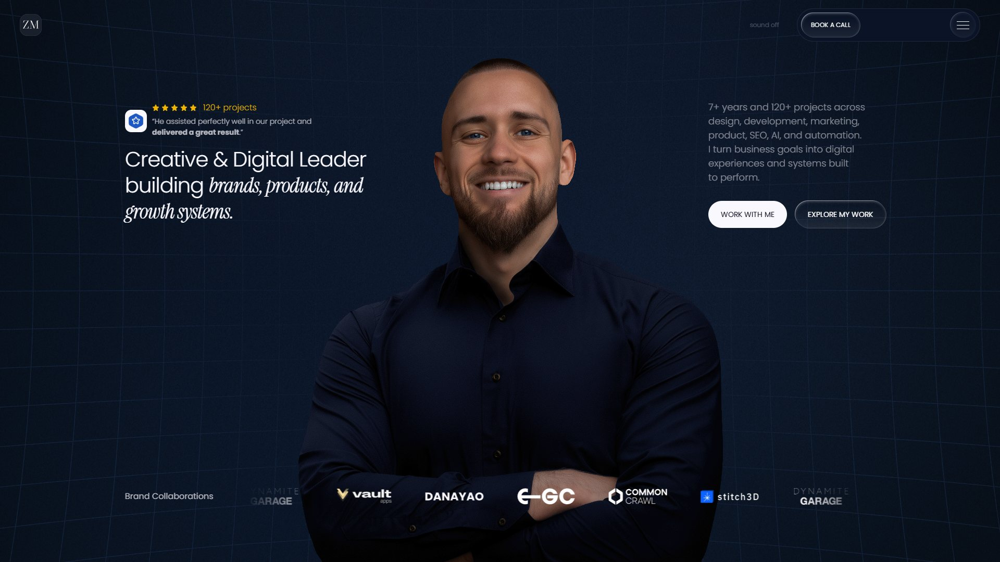

  

# Zlatko Marjanović

### AI Product Developer · Cursor, Claude Code, Next.js, Supabase

I take AI-generated and vibe-coded prototypes and ship them as production products. 
Auth, data, payments, deploy, then I stay as the person who owns the roadmap.

7+ years building for SaaS, healthcare, wellness, real estate, and nonprofits. 
Based in Bosnia (CET). Full-time. Long-term product seats.

 

 

`7+ years` `120+ projects` `80+ five-star reviews` `100% Upwork JSS`

 

---

## Now

**[StrikeOS](https://strikeos.co)** · AI striking coach

Film a round. Get a score, the top three mistakes with timestamps, and drills built from that tape.

`Next.js` `AI vision` `product` `shipping now`

 

---

## Products

<table>
<tr>
<td width="50%" valign="top">

#### [WhenGTA6](https://www.whengta6.com) · GTA VI content site

SEO publication around the GTA VI launch. Countdown, guides, rumor board, and search pages built to rank.

`Astro` `SEO` `content system`

</td>
<td width="50%" valign="top">

#### [Preflight](https://preflight-landing-page.vercel.app) · Framer launch QA

Scans a live Framer project for SEO, a11y, CMS, and launch blockers. Optional MCP auto-fix.

`Framer plugin` `Claude` `MCP`

</td>
</tr>
<tr>
<td width="50%" valign="top">

#### [CMS Forge](https://www.framer.com/marketplace/plugins/cms-forge/) · Framer CMS editor

Spreadsheet-style bulk edit for Framer collections. Find/replace, CSV, validation, safer publish.

`Framer plugin` `CMS` `bulk edit`

</td>
<td width="50%" valign="top">

#### [EditLayer](https://editlayer-landing.vercel.app) · live visual editing

Add `?edit=true` to a Next.js site. Edit copy on the page. Publish. Vercel redeploys.

`Next.js` `npm` `inline editing`

</td>
</tr>
</table>

 

---

## Client work

<table>
<tr>
<td width="50%" valign="top">

#### [Vault Apps](https://www.vaultapps.com/) · SaaS marketing platform

Conversion UX, CMS, performance, and technical SEO for a software agency that needed to present work clearly and maintain it without a full-time developer.

`SaaS` `CMS` `CRO` `SEO`

</td>
<td width="50%" valign="top">

#### [Mavesta Media](https://mavestamedia.com/) · brand + platform rebuild

Full brand refresh, UI, CMS, SEO, and conversion motion. Built so the company can sell services and keep growing the site.

`brand` `UX` `motion` `CMS`

</td>
</tr>
<tr>
<td width="50%" valign="top">

#### [MAVI Longevity](https://mavilongevity.com/) · wellness real estate

Positioning, cinematic UX, and dual funnels for developers and homeowners around the Longevity Home Blueprint.

`positioning` `lead systems` `UX`

</td>
<td width="50%" valign="top">

#### [EGC NYC](https://egcnyc.org/) · nonprofit platform

Program discovery, CMS, SEO, and local search. Ranked **#1 for "EGC NYC"** and drives **~50k monthly visitors**.

`SEO` `CMS` `nonprofit`

</td>
</tr>
</table>

 

---

## Process

How a prototype becomes a product I can keep owning.

<table>
<tr>
<td width="25%" valign="top">

**01 · Intake**

Cursor, Claude Code, Lovable, Bolt, v0, Replit, Base44. I read the prototype, the stack, and what is actually broken.

</td>
<td width="25%" valign="top">

**02 · Productionize**

Auth, database, APIs, payments, permissions, deploy. The unglamorous layer that makes it real.

</td>
<td width="25%" valign="top">

**03 · Ship**

Vercel, Stripe, Supabase / Firebase, webhooks. Live URL, analytics, the first real users.

</td>
<td width="25%" valign="top">

**04 · Own**

I stay. Roadmap, fixes, SEO, automation. Long-term product seat, not a handoff.

</td>
</tr>
</table>

 

---

## Experience

<table>
<tr>
<td width="33%" valign="top" align="center">

### 7+ years

Websites, products, and growth systems shipped end to end.

</td>
<td width="33%" valign="top" align="center">

### 120+ projects

SaaS, healthcare, wellness, real estate, nonprofits.

</td>
<td width="33%" valign="top" align="center">

### 80+ five-star

Reviews across Upwork, Fiverr, Contra, and LinkedIn.

</td>
</tr>
<tr>
<td width="33%" valign="top" align="center">

### 100% JSS

Upwork Job Success. Long-term product seats.

</td>
<td width="33%" valign="top" align="center">

### Marketplace

Preflight + CMS Forge. Framer plugins in production.

</td>
<td width="33%" valign="top" align="center">

### ZedNova

Founder. Studio for product and web work.

</td>
</tr>
</table>

 

<table>
<tr>
<td>

 

**“The best web developer you could ever ask for. He did an amazing job with our website and we will be working with him in the future for more projects. Highly recommend Zlatko for any high-end website needs.”**

Alexander Karima · Co-founder, [Mavesta Media](https://mavestamedia.com/)

</td>
</tr>
</table>

 

---

## Stack

<table>
<tr>
<td width="25%" valign="top">

**AI & agents**

`Cursor` `Claude Code` `OpenAI` `Claude` `Gemini` `MCP` `Lovable` `Bolt` `v0`

</td>
<td width="25%" valign="top">

**App layer**

`Next.js` `React` `TypeScript` `JavaScript` `Node.js` `Astro` `Tailwind` `HTML / CSS`

</td>
<td width="25%" valign="top">

**Data & auth**

`Supabase` `Firebase` `PostgreSQL` `MongoDB` `Prisma` `REST APIs` `GraphQL` `Webhooks`

</td>
<td width="25%" valign="top">

**Payments & infra**

`Stripe` `Vercel` `GitHub` `n8n` `Make` `WebSockets` `GA4`

</td>
</tr>
<tr>
<td width="25%" valign="top">

**Design & motion**

`Figma` `GSAP` `Three.js` `Framer Motion`

</td>
<td width="25%" valign="top">

**Web platforms**

`Webflow` `Framer` `Shopify` `CMS`

</td>
<td width="25%" valign="top">

**Growth**

`SEO` `AEO` `CRO` `PageSpeed`

</td>
<td width="25%" valign="top">

**Where I live**

Bosnia · CET · 30+ hrs / week

</td>
</tr>
</table>

 

